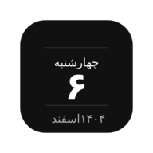
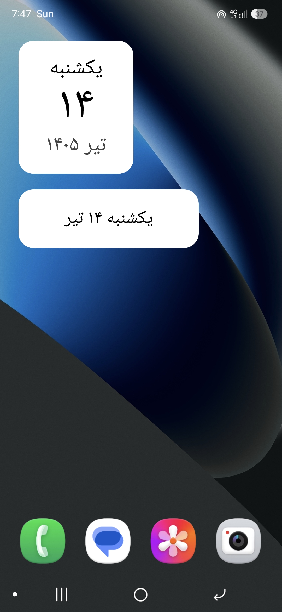
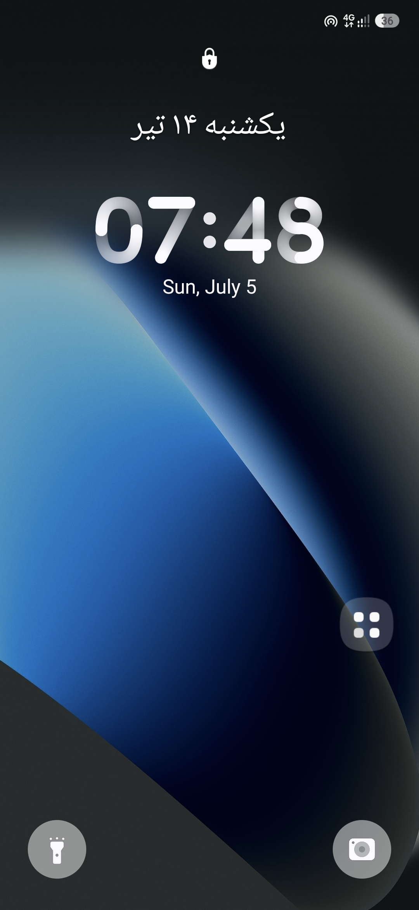
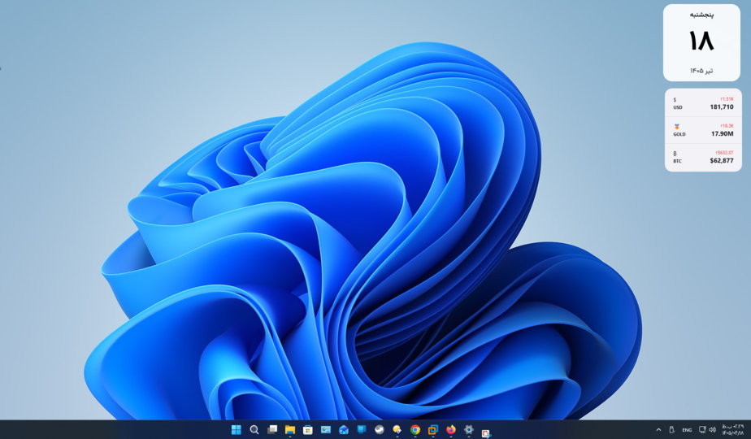

# ShamsiCal Widget

### ویجت تقویم شمسی برای اندروید و ویندوز

تقویم شمسی مینیمال برای صفحه اصلی و صفحه قفل اندروید، و کارت شناور روی دسکتاپ ویندوز

الهام گرفته از اپ **ShamsiCal** برای iOS

---

## ✨ ویجت‌های اندروید

### 🗓 ویجت 2×2 صفحه اصلی

نمایش روز هفته، عدد روز و ماه شمسی در قالبی مینیمال و خوانا.

### 📝 ویجت متنی 3×1

نمایش فشرده تاریخ شمسی برای کاربرانی که طراحی ساده‌تر را ترجیح می‌دهند.

• هماهنگ با طراحی ویجت اصلی 
• پس‌زمینه روشن در Light Mode 
• پس‌زمینه تیره در Dark Mode

---

### 🔒 ویجت صفحه قفل

نمایش افقی روز، عدد و ماه شمسی روی صفحه قفل.

پشتیبانی از:

• Samsung One UI 
• Good Lock 
• LockStar 
• برخی لانچرهای شخص ثالث

---

## 🪟 نسخه‌ی ویندوز

### 🔹 کارت شناور دسکتاپ (Always-on-top):

* نمایش تاریخ شمسی زنده (روز هفته، عدد روز، ماه) با فونت Vazirmatn، هماهنگ با ویجت 2×2 اندروید.
* با موس قابل جابجاییه؛ موقعیت، حالت تیره/روشن و Always-on-top ذخیره می‌شن.
* کلیک روی کارت → باز شدن یک **پنجره‌ی تقویم ماهانه کامل** 
* آیکون System Tray + منوی راست‌کلیک (باز کردن تقویم، Always-on-top، حالت تیره، اجرا با ویندوز، خروج).

---

## 🚀 امکانات

✅ تقویم شمسی دقیق و مستقل 
✅ پشتیبانی از صفحه اصلی و صفحه قفل (اندروید) 
✅ کارت شناور دسکتاپ Always-on-top (ویندوز) 
✅ طراحی مینیمال 
✅ سازگار با Dark Mode 
✅ بروزرسانی خودکار در ابتدای هر روز 
✅ بازیابی خودکار پس از راه‌اندازی مجدد دستگاه (اندروید) / اجرا هنگام روشن شدن ویندوز (ویندوز) 
✅ فونت Vazirmatn 
✅ گوشه‌های گرد و طراحی مدرن 
✅ مصرف بسیار کم باتری/منابع

---

## 📲 نصب ویجت

### صفحه اصلی (اندروید)

1. صفحه اصلی را لمس و نگه دارید.
2. وارد بخش **Widgets** شوید.
3. **ShamsiCal Widget** را انتخاب کنید.
4. یکی از ویجت‌های زیر را اضافه کنید.

🗓 تقویم شمسی 2×2 
📝 تقویم شمسی متنی 3×1

---

### صفحه قفل (اندروید)

برای دستگاه‌های سازگار:

1. صفحه قفل را لمس و نگه دارید.
2. وارد بخش **Widgets** شوید.
3. ویجت **تقویم شمسی (Lock Screen)** را انتخاب کنید.

---

### دسکتاپ (ویندوز)

1. آخرین `ShamsiCalWidget.exe` را از تب [Actions](../../actions) یا [Releases](../../releases) دانلود کنید.
2. فایل را اجرا کنید — نیازی به نصب پایتون یا هیچ وابستگی دیگری نیست.
3. برای اجرای خودکار هنگام روشن شدن ویندوز، از منوی راست‌کلیک روی کارت گزینه‌ی مربوطه را فعال کنید.

---

## ⚠️ سازگاری

<table>

<tr>
<th>پلتفرم / دستگاه</th>
<th>پشتیبانی</th>
</tr>

<tr>
<td>Samsung One UI 5+</td>
<td align="center">✅</td>
</tr>

<tr>
<td>Samsung One UI 6+</td>
<td align="center">✅</td>
</tr>

<tr>
<td>Good Lock + LockStar</td>
<td align="center">✅</td>
</tr>

<tr>
<td>Pixel Launcher</td>
<td align="center">❌</td>
</tr>

<tr>
<td>AOSP</td>
<td align="center">❌</td>
</tr>

<tr>
<td>لانچرهای شخص ثالث (اندروید)</td>
<td align="center">⚠️ محدود</td>
</tr>

<tr>
<td>Windows 10 / 11</td>
<td align="center">✅</td>
</tr>

</table>

---

## 🎨 طراحی

• فونت: **Vazirmatn** 
• گوشه‌های گرد 
• Light & Dark Theme 
• طراحی مینیمال و خوانا 
• هماهنگ با زبان فارسی

---

ساخته شده برای کاربرانی که یک تقویم شمسی ساده، زیبا و همیشه در دسترس می‌خواهند — چه روی گوشی، چه روی دسکتاپ.

